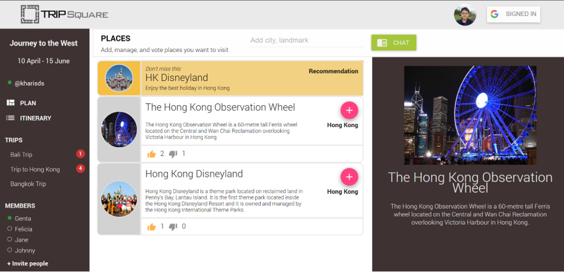

# tripsquare 
#### Second Runner-Up Winner in HackUST 2017
A collaborative real-time travel app planner, helps families, friends to plan their trip effectively and away from congestion.

## Front-end
- React for UI
- Node Js
- with socket.io for front-end and back-end communication

## Back-end
- Node Js
- broadcast chat
- request to Google Direction API for acquiring the most optimal route

## Our amazing team
- Genta Indra Winata - Ph.D. student (Electronic and Computer Engineering - HKUST)
- Felicia Agatha - Undergraduate student (Computer Science Major - HKUST) 
- Kharis Daniel Setiasabda - Undergraduate student (Chemical Engineering Major - PolyU)
